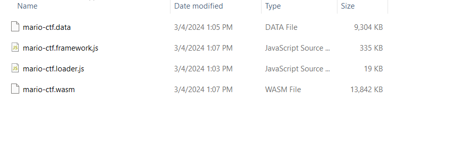
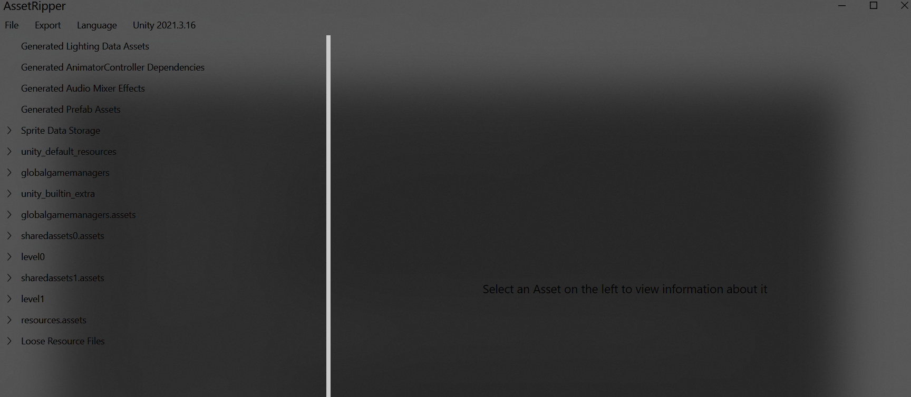
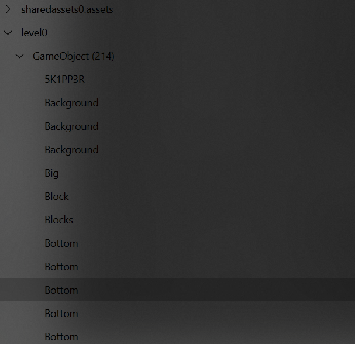
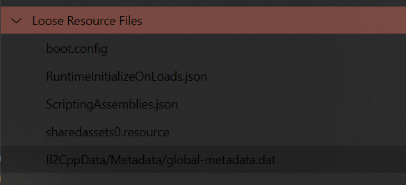
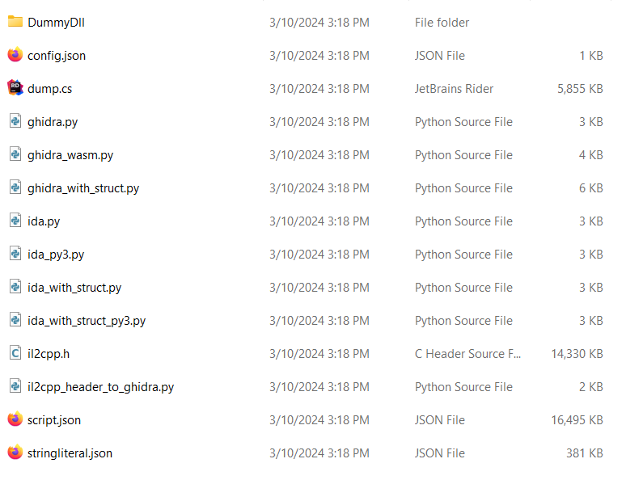
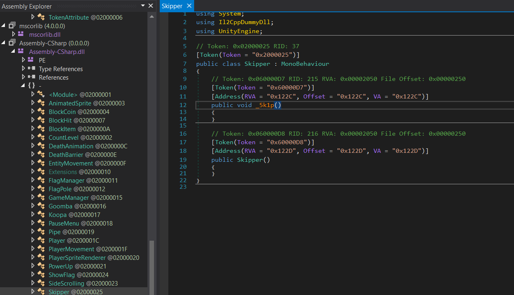

### Can you help Mario capture the flag?


## Prerequisites

Before running the game, make sure you have the following installed:

- Node.js and npm

## Installation

1. Open your terminal or command prompt.
2. Run the following command to install the http-server package globally:

    ```shell
    npm install http-server -g
    ```

## Running the Game

1. In your terminal or command prompt, navigate to the game directory.
2. Run the following command to start the http-server on port 8001:

    ```shell
    http-server -p 8001
    ```

3. Open your web browser and go to [http://localhost:8001/index.html](http://localhost:8001/index.html) to play the game.


## Solving the challenge 

The main idea behind this challenge is to utilize the [Unity WebGL Interacting with Browser Scripting API](https://docs.unity3d.com/Manual/webgl-interactingwithbrowserscripting.html).

1. First we need to modify the `index.html` so that we can interact with the game objects from the browser's console: 

    ```
    var MyGameInstance = null;
    script.onload = () => {
        createUnityInstance(canvas, config, (progress) => {...}).then((unityInstance) => {
        MyGameInstance = unityInstance;

    ```

2. According to the docs we can now use the `MyGameInstance.SendMessage('MyGameObject', 'MyFunction');` to interact with unity game objects, now the only thing left to do is to find the name of the game object and the function that can allow us to skip levels.

3. To do that we must take a look at game files, the build has the following files: 

    

    we can see .data files and .wasm files, the .data is the file that contains the assets and game files, .wasm is the binary file that contains the code (compiled from C#) we're also gonna need it later.

4. Tools like [Asset Ripper](https://github.com/AssetRipper/AssetRipper/releases/tag/0.3.4.0) allow us to do this easily, when we open the .data file with asset ripper we see the following: 

    

    Let's open `level0` and look for a game object with an unsual name: 

    

    We can see a game object `5K1PP3R`, great now we know the name of the game object, all there's left to do is to find the name of the function that we need to call.

5. To inspect the code can use a tool like [IL2CPPDumper](https://il2cppdumper.com/the-dumper-tool), we can see that it takes as input a binary file (in our case .wasm) and a .dat file, to get the .dat file we need to go back to the Asset Ripper and export it:

    

    When we download the given .zip we can see these files: 

    

    We're only interested in DLL files tho, since they contain the source code, to open those we need a tool like[dnSpy](https://github.com/dnSpy/dnSpy/releases/tag/v6.1.8), opening the `Il2CppDummyDll.dll` we can see the all the scripts used in the game, we can also see a script called `Skipper.cs` and `FlagManager.cs`, remember the latter because we'll need it later. 

    

    We can see it has a `_5kip()` function, great now we have all we need, the only thing left to do is to go back to the console and call it:

    ```
    for (let i = 0; i < 10000; i++) {
    MyGameInstance.SendMessage('5K1PP3R', '_5kip()');
    }
    ```

You have now skipped all the levels, the silence is loud and there's one last obstacle, but you need to figure out how to hack that on your own :P 
